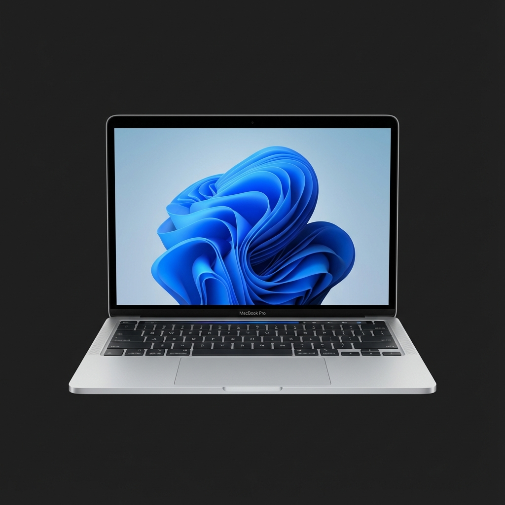

# macOS Portfolio Simulator

A fully interactive portfolio website that simulates the macOS desktop experience in your browser. Built with **Next.js 16**, **React 19**, **Tailwind CSS**, and **Framer Motion**.



## 🚀 Overview

This project recreates the look and feel of macOS, offering a familiar desktop interface to showcase portfolio content. It features a window management system, functional apps, a simulated file system, and system-level controls like Spotlight and Control Center.

## ✨ Features

- **Desktop Environment:**
  - Draggable and resizable windows.
  - Functional Dock with minimization animations.
  - Global Menu Bar with dynamic clock and status items.
  - Context Menus (Right-click) on desktop and files.
  - Drag-and-select functionality for desktop icons.

- **Apps & Tools:**
  - **Finder:** Browse a simulated file system (create folders, rename, delete files).
  - **Terminal:** Interactive shell supporting commands like `ls`, `help`, `whoami`, `date`, `uname`, `clear`.
  - **Safari:** Simulated web browser interface.
  - **Profile:** Dedicated app to showcase personal portfolio information.
  - **Settings:** System preferences simulation.
  - **About This Mac:** System information modal.

- **System Features:**
  - **Spotlight Search:** Press `Cmd + Space` (or `Ctrl + Space`) to open.
  - **Control Center:** Adjust system brightness and volume.
  - **Notification Center:** View system notifications.
  - **Boot Animation:** Realistic Apple boot sequence on initial load.
  - **Lock Screen/Shutdown:** Simulated system power states.

## 🛠️ Tech Stack

- **Framework:** [Next.js 16](https://nextjs.org/) (App Router)
- **Core:** [React 19](https://react.dev/)
- **Styling:** [Tailwind CSS 4](https://tailwindcss.com/)
- **Animations:** [Framer Motion](https://www.framer.com/motion/)
- **Icons:** [Lucide React](https://lucide.dev/)
- **State Management:** React Context API & Custom Hooks

## 📦 Getting Started

### Prerequisites

- Node.js 18+ installed on your machine.
- npm, pnpm, or yarn.

### Installation

1. Clone the repository:
   ```bash
   git clone https://github.com/yourusername/portafolio.bryanvrgsc.git
   cd portafolio.bryanvrgsc
   ```

2. Install dependencies:
   ```bash
   npm install
   # or
   pnpm install
   # or
   yarn install
   ```

3. Run the development server:
   ```bash
   npm run dev
   ```

4. Open [http://localhost:3000](http://localhost:3000) in your browser.

## ⌨️ Shortcuts

| Shortcut | Action |
|----------|--------|
| `Cmd + Space` | Toggle Spotlight Search |
| `Ctrl + Space` | Toggle Spotlight Search |
| `Cmd + W` | Close Active Window |
| `Ctrl + W` | Close Active Window |
| `Double Click` | Open File/App |
| `Right Click` | Open Context Menu |

## 📂 Project Structure

```
├── app/                  # Next.js App Router pages
├── components/           # UI Components (Desktop, Dock, Apps)
│   ├── Apps/             # Individual App Components
│   ├── System/           # System Components (MenuBar, ControlCenter)
│   └── Window.tsx        # HOC for Window Management
├── context/              # Global State (SystemContext)
├── hooks/                # Custom Hooks (useFileSystem)
├── lib/                  # Utilities
└── public/               # Static Assets (Images, Icons)
```

## 🤝 Contributing

Contributions are welcome! Please feel free to submit a Pull Request.

1. Fork the project
2. Create your feature branch (`git checkout -b feature/AmazingFeature`)
3. Commit your changes (`git commit -m 'Add some AmazingFeature'`)
4. Push to the branch (`git push origin feature/AmazingFeature`)
5. Open a Pull Request

## 📄 License

This project is open source and available under the [MIT License](LICENSE).